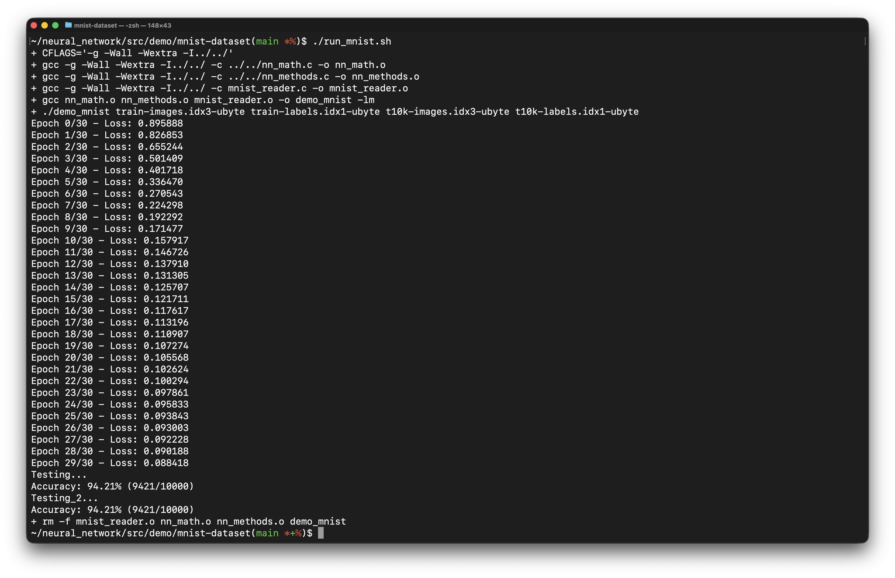

# Neural Network Framework in C

A lightweight, "from-scratch" neural network framework implemented in pure C.

No external libraries, no hidden abstractions—just pointers, matrices, and partial derivatives.

**Note:** This is an educational project, not a production-grade ML library... **YET.**

---

## Project Goals & Implementation

### 1. Fundamental Understanding

**Goal:** Deconstruct the "black box" of neural networks to understand the underlying calculus and linear algebra.

**Result:** This project was built by studying theory from the following resources:

* **Papers & Books:**
* [Neural Networks and Deep Learning](http://neuralnetworksanddeeplearning.com/) – Michael Nielsen
* [The Math in Neural Networks](https://www.linkedin.com/feed/update/urn:li:activity:7074376524254101504/) – Brooke Joseph
* [Mathematics of Neural Networks](https://arxiv.org/abs/2403.04807) – Bart M.N. Smets


* **Video Series:**
* [3Blue1Brown Neural Networks Playlist](https://www.3blue1brown.com/topics/neural-networks)
* [Tsoding Daily NN in C](https://www.google.com/search?q=https://youtu.be/PGSba51aRYU)
* [Samson Zhang - NN from Scratch](https://www.google.com/search?q=https://youtu.be/w8yWXqWQYmU)


### 2. Zero Dependencies

**Goal:** Build the entire engine using only the C standard library to ensure maximum portability and transparency.

**Result:** The logic is strictly organized into modular C files without a single external ML dependency:

```text
src
├── nn_methods.c/h      # Core framework logic (Backprop, Feedforward)
├── nn_math.c/h         # Linear algebra & activation functions
├── demo/               # Implementation of XOR and MNIST projects
└── tests/              # Unit tests for mathematical validation
```

### 3. Extensible Architecture

**Goal:** Create a reusable framework that can be adapted to various network structures and layers.

**Result:** Developed a generic API that supports multiple demos. The same core framework powers both a simple XOR gate solver and a complex handwritten digit classifier.

**Note:** The training of handwritten digit classifier neural network in basde on the [MNIST Dataset](https://www.kaggle.com/datasets/hojjatk/mnist-dataset) and in the architecture described in [3Blue1Brown](https://www.youtube.com/watch?v=aircAruvnKk&list=PLZHQObOWTQDNU6R1_67000Dx_ZCJB-3pi) video.



### 4. Real-World Application

**Goal:** Successfully train and validate the framework using the MNIST handwritten digit dataset.

**Result:** Created a **"Digit Paint Recognizer"** demo. After training on the MNIST dataset (one of the previous demoss), the model is used in a real-time drawing application to recognize user-drawn digits.


> **Note on Accuracy:** Because this demo uses a simple canvas rather than the exact MNIST preprocessing standard, inputs can be sensitive (e.g., a "9" might be interpreted as an "8" in the video). However, it demonstrates the framework successfully coming to life.

---

## Implementation Notes
I have sumarized my notes during the implementation in: `neural_network_implementation_notes.pdf`

---

